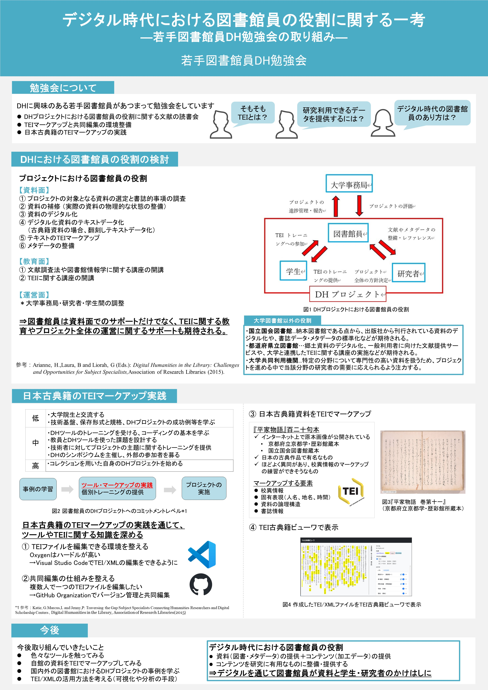

---
title: "20240721"
weight: 2
# bookFlatSection: false
# bookToc: true
# bookHidden: false
# bookCollapseSection: false
# bookComments: false
# bookSearchExclude: false
---
## DHシンポジウム「図書資料の構造化　研究データとしてのテキストデータ構築」発表資料
* 2024年7月21日のDHシンポジウム[「図書資料の構造化　研究データとしてのテキストデータ構築」](https://tei.dhii.jp/activities/dh-teisympo2024)のポスター発表資料を掲載します。
* シンポジウム発表時の資料では、勉強会参加者の個人名・所属を記載していましたが、HP掲載にあたって「若手図書館DH勉強会」に変更しています。ご承知おきください。

