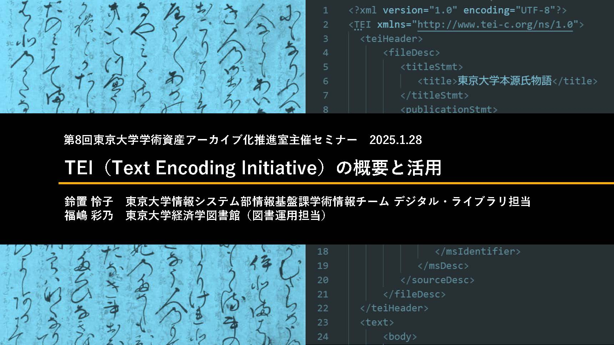
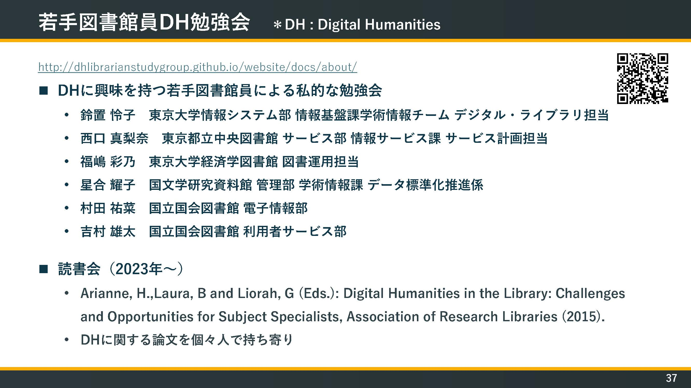
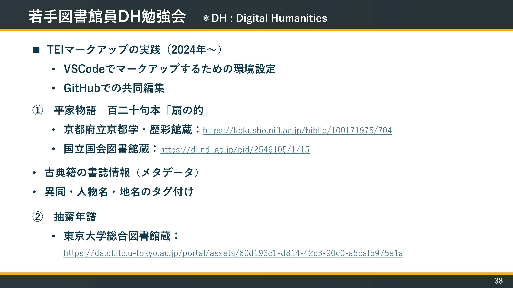

## 第8回東京大学学術資産アーカイブ化推進室主催セミナー
* [第8回東京大学学術資産アーカイブ化推進室主催セミナー](https://www.lib.u-tokyo.ac.jp/ja/library/contents/event/20250128)にて、若手図書館員DH勉強会の活動を紹介しました。
 

### **資料**
---
* [第8回東京大学学術資産アーカイブ化推進室主催セミナー](https://repository.dl.itc.u-tokyo.ac.jp/search?search_type=2&q=1739515035420)
* [鈴置怜子・福嶋彩乃「TEI（Text Encoding Initiative）の概要と活用」](http://hdl.handle.net/2261/0002010614)

### **資料抜粋**
---

