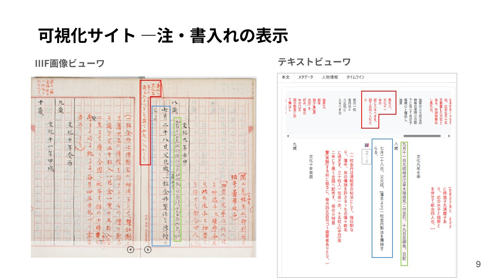

## 第139回 人文科学とコンピュータ研究発表会
* 2025年8月3日に開催された[第139回 人文科学とコンピュータ研究発表会](https://www.jinmoncom.jp/?CH139)で口頭発表を行いました。

### **研究報告**
---
**年譜資料の構造化と可視化―森鷗外「抽斎年譜」を例に―**

鈴置怜子・市太佐知・西口真梨奈・福嶋彩乃・星合耀子・村田祐菜・吉村雄太

概要：東京大学総合図書館所蔵『抽斎年譜』を対象に、TEI/XML 形式でテキストを構造化し、可視化サイトを構築した事例を報告する。『抽斎年譜』は、森鷗外が史伝小説『渋江抽斎』執筆のために抽斎の息子・渋江保に制作を依頼した年譜資料であり、編年体の『渋江抽斎』は本書に大きく依拠するとされる。本資料には、朱筆や墨筆による書き込みや加筆・訂正のほか、鷗外自筆の書き込みも見られる。このような特徴を表現するために、構造化と可視化の方法を検討した。本発表の取組みは、所属機関の異なる図書館職員らによる共同でのTEI マークアップ実践事例としても意義があると考える。

### **発表資料**
---

---
